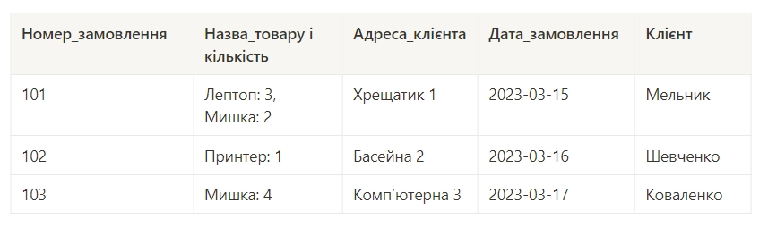

Нормалізовано таблицю до 1НФ.
Нормалізовано таблицю до 2НФ.
Нормалізовано таблицю до 3НФ.
Використано зрозумілі та конкретні імена для сутностей та атрибутів. 
Уточнено типи даних для атрибутів. 
Усі відношення й атрибути мають чіткі і зрозумілі кардинальності та значення.
Створено таблиці в базі даних (тільки таблиці й колонки з урахуванням зв'язків) 
вручну або автоматично. Розгорнута схема з Workbench додана.